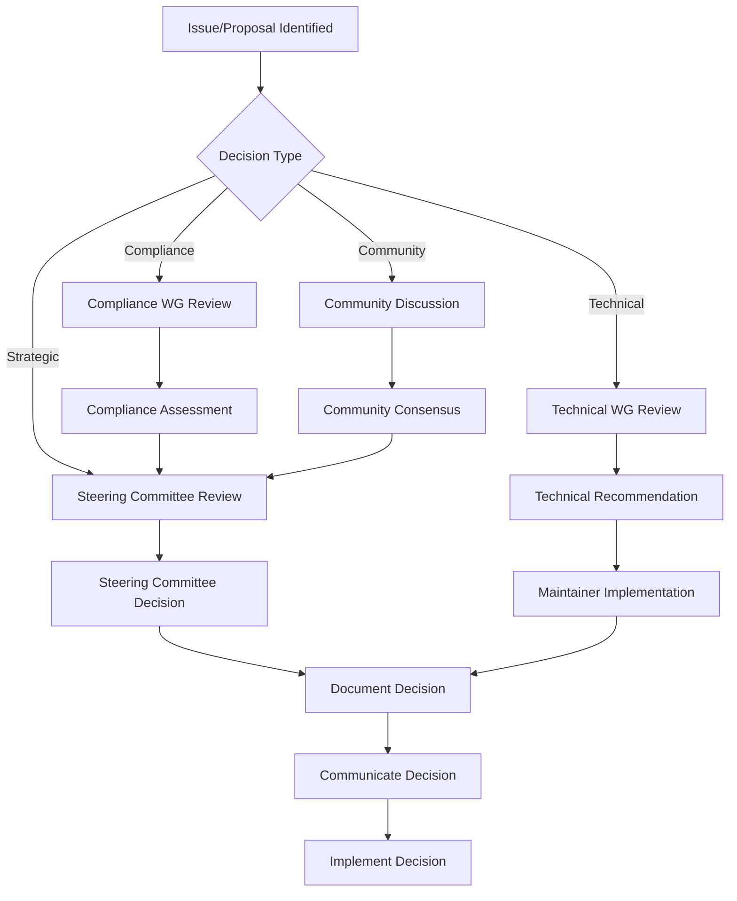

# Governance Model

## Overview

This document outlines the governance structure, decision-making processes, and community roles for the GrantReady Documentation repository. The governance model is designed to ensure transparency, inclusivity, and compliance with regulatory requirements.

## Governance Principles

### Core Principles
1. **Transparency**: All decisions and processes are documented and accessible
2. **Inclusivity**: Diverse perspectives from government, nonprofit, and private sectors
3. **Compliance**: Alignment with regulatory requirements and best practices
4. **Sustainability**: Long-term maintenance and evolution of the project
5. **Quality**: Commitment to high standards in documentation and code

### Decision-Making Values
- **Evidence-based**: Decisions supported by data and research
- **Collaborative**: Input from all relevant stakeholders
- **Timely**: Efficient processes without unnecessary delays
- **Accountable**: Clear responsibility for decisions and outcomes

## Governance Structure

### Steering Committee

#### Purpose
The Steering Committee provides strategic direction, oversees compliance, and makes high-level decisions about the project's future.

#### Composition
- **5-7 members** representing diverse stakeholder groups
- **Term**: 2 years, with possibility of renewal
- **Meetings**: Quarterly, with emergency meetings as needed

#### Current Members
| Role | Organization Type | Responsibilities |
|------|-------------------|------------------|
| Chair | Government Agency | Overall leadership, compliance oversight |
| Vice Chair | Nonprofit Organization | Community engagement, stakeholder relations |
| Technical Lead | Technology Partner | Technical architecture, implementation |
| Compliance Officer | Regulatory Body | Regulatory alignment, audit readiness |
| Community Representative | User Community | User needs, adoption feedback |

### Working Groups

#### Purpose
Working groups focus on specific areas of the project, developing recommendations for the Steering Committee.

#### Active Working Groups
1. **Compliance Working Group**
   - Focus: Regulatory updates, compliance frameworks
   - Members: Compliance officers, legal experts, auditors

2. **Technical Standards Working Group**
   - Focus: Schema development, technical specifications
   - Members: Developers, architects, data specialists

3. **Documentation Working Group**
   - Focus: Template quality, documentation standards
   - Members: Technical writers, grant managers, users

4. **Community Engagement Working Group**
   - Focus: Outreach, adoption, training
   - Members: Community managers, trainers, advocates

### Maintainers

#### Purpose
Maintainers are responsible for day-to-day management of the repository, including code review, issue management, and release coordination.

#### Responsibilities
- Review and merge pull requests
- Triage issues and bug reports
- Ensure code quality and documentation standards
- Coordinate releases and versioning
- Maintain community standards and code of conduct

#### Current Maintainers
- [List of maintainers with contact information]

## Decision-Making Processes

### Types of Decisions

#### Strategic Decisions
- **Scope**: Project direction, major features, partnerships
- **Process**: Steering Committee approval required
- **Timeline**: Quarterly review cycle

#### Technical Decisions
- **Scope**: Architecture, schema changes, implementation details
- **Process**: Technical Working Group recommendation, Maintainer implementation
- **Timeline**: As needed, with bi-weekly review

#### Compliance Decisions
- **Scope**: Regulatory alignment, compliance requirements
- **Process**: Compliance Working Group review, Steering Committee approval
- **Timeline**: Monthly review, immediate for regulatory changes

#### Community Decisions
- **Scope**: Code of conduct, contribution guidelines, community standards
- **Process**: Community input, Steering Committee ratification
- **Timeline**: Annual review, ad-hoc as needed

### Decision-Making Workflow

Voting Procedures

Steering Committee Votes

· Quorum: 60% of members present
· Majority: Simple majority for routine decisions
· Super Majority: 75% for strategic or compliance decisions
· Abstentions: Counted toward quorum but not toward majority

Working Group Consensus

· Working groups operate on consensus model
· Formal votes only when consensus cannot be reached
· Minutes documented for all decisions

Conflict Resolution

Escalation Path

1. Direct Discussion: Parties attempt to resolve directly
2. Mediation: Neutral third party facilitates discussion
3. Working Group Review: Relevant working group reviews
4. Steering Committee: Final appeal to Steering Committee

Principles

· Focus on project goals, not personal positions
· Respect diverse perspectives and expertise
· Documentation of all resolution attempts
· Timely resolution to prevent project delays

Contribution Process

Contributor Levels

Users

· Role: Use the documentation and provide feedback
· Path: Submit issues, participate in discussions

Contributors

· Role: Submit improvements via pull requests
· Path: Follow contribution guidelines, receive review

Maintainers

· Role: Review contributions, manage releases
· Path: Invitation based on consistent quality contributions

Working Group Members

· Role: Specialized expertise in specific areas
· Path: Application and approval by Steering Committee

Contribution Guidelines

For Documentation

1. Follow style guidelines in CONTRIBUTING.md
2. Include regulatory references where applicable
3. Test templates with sample data
4. Update version numbers and change logs

For Code/Schemas

1. Pass all validation tests
2. Include comprehensive documentation
3. Follow security best practices
4. Maintain backward compatibility where possible

Review Process

1. Initial Review: Within 7 business days
2. Feedback: Constructive, specific, timely
3. Revision: Contributor addresses feedback
4. Approval: Two maintainer approvals required
5. Merge: Squash merge with descriptive message

Release Management

Versioning Strategy

Semantic Versioning

· MAJOR: Breaking changes, regulatory requirements
· MINOR: New features, backward-compatible
· PATCH: Bug fixes, documentation updates

Release Schedule

· Monthly: Patch releases for urgent fixes
· Quarterly: Minor releases with new features
· Annual: Major releases with compliance updates

Release Process

Planning Phase (Week 1-2)

· Gather requirements from working groups
· Prioritize features and fixes
· Create release milestone in GitHub

Development Phase (Week 3-4)

· Implement planned changes
· Code review and testing
· Documentation updates

Quality Assurance (Week 5)

· Schema validation
· Template testing
· Compliance verification
· Security review

Release Preparation (Week 6)

· Final documentation review
· Version number updates
· Release notes preparation
· Communication plan

Release (Week 7)

· Tag release in GitHub
· Publish release notes
· Update documentation site
· Community announcement

Post-Release

· Monitor for issues
· Gather feedback
· Plan next release cycle

Compliance and Oversight

Regulatory Compliance

Monitoring

· Weekly: Regulatory news monitoring
· Monthly: Compliance status review
· Quarterly: Comprehensive compliance audit

Documentation

· All compliance decisions documented
· Regulatory impact assessments
· Audit trail for all changes

Quality Assurance

Standards

· Documentation follows style guide
· Schemas pass validation tests
· Examples demonstrate real-world usage
· Templates are usable and accessible

Review Process

· Peer review for all contributions
· Automated testing for technical components
· User testing for templates and documentation
· Accessibility review for all content

Community Engagement

Communication Channels

Primary Channels

· GitHub Issues: Feature requests, bug reports
· GitHub Discussions: Community conversations
· Mailing Lists: Announcements, working group communication
· Community Calls: Monthly virtual meetings

Transparency

· All meetings have published agendas and minutes
· Decisions documented in GitHub
· Roadmap publicly available
· Regular progress reports

Outreach and Adoption

Government Outreach

· Engagement with federal, state, and local agencies
· Partnership with grant-making organizations
· Participation in government working groups

Nonprofit Engagement

· Training and documentation for nonprofits
· Feedback collection from users
· Case studies and success stories

Private Sector Collaboration

· Integration with grant management systems
· Technology partnerships
· Commercial support options

Financial Governance

Funding Model

Current Funding

· Foundations: Grant funding for development
· Government: Contract support for compliance work
· Sponsorships: Corporate sponsors for specific features

Financial Transparency

· Annual financial report
· Budget publicly available
· Spending aligned with project goals

Resource Allocation

Priority Areas

1. Compliance: Regulatory updates and verification
2. Documentation: Template maintenance and improvement
3. Technology: Schema development and validation
4. Community: Outreach, training, support

Decision Criteria

· Alignment with project mission
· Regulatory requirements
· Community needs and impact
· Available resources and expertise

Success Metrics

Key Performance Indicators

Adoption Metrics

· Number of organizations using templates
· Downloads of schemas and documentation
· Integration with grant management systems

Quality Metrics

· Documentation accuracy score
· Schema validation pass rate
· User satisfaction surveys

Community Metrics

· Number of contributors
· Diversity of stakeholder representation
· Response time for issues and questions

Compliance Metrics

· Regulatory coverage percentage
· Audit readiness score
· Compliance verification success rate

Reporting

· Monthly: Progress against KPIs
· Quarterly: Comprehensive report to Steering Committee
· Annual: Public annual report

Amendment Process

Governance Changes

1. Proposal: Any community member may propose changes
2. Discussion: Minimum 30-day community discussion period
3. Revision: Working group incorporates feedback
4. Vote: Steering Committee super-majority (75%) required
5. Implementation: Updated governance document published

Emergency Procedures

· Security Issues: Immediate response by security team
· Regulatory Changes: Expedited compliance process
· Critical Bugs: Emergency patch release process

Appendices

Appendix A: Steering Committee Charter

[Detailed charter document]

Appendix B: Working Group Charters

[Individual working group charters]

Appendix C: Decision Log Template

[Template for documenting decisions]

Appendix D: Meeting Procedures

[Detailed meeting protocols]

---

Governance Version: 1.0.0
Last Updated: [Current Date]
Next Review: [Date - One year from last update]
